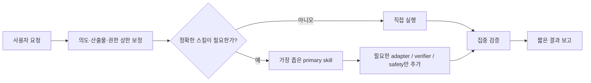

# Codex Agent Kit

현재 실제로 사용하는 `~/.codex` 설정을 인증값과 런타임 상태를 제외하고 공유 가능한 형태로 정리한 저장소입니다.

이 저장소는 초기 skill 모음에서 출발했지만, 지금은 다음 원칙으로 운영되는 개인 Codex 설정 스냅샷입니다.

- 거친 한국어·축약 요청은 목표와 산출물만 조용히 보정합니다.
- 확인·분석·제안 요청을 임의로 수정 작업으로 확대하지 않습니다.
- 별도 meta-router 없이 Codex의 native skill-description matching을 사용합니다.
- 스킬 조합은 `primary`, `adapter`, `verifier`, 조건부 `safety`로 제한합니다.
- 독립적인 큰 작업축이 두 개 이상일 때만 병렬 에이전트를 사용합니다.
- 전역 스킬과 프로젝트 전용 pack을 분리해 일반 작업의 prompt noise를 줄입니다.

공개 페이지:

```text
https://seung-won-yu.github.io/codex-agent-kit/
```

## 현재 구성

| 영역 | 현재 값 |
| --- | ---: |
| 기본 모델 | `gpt-5.6-sol` + `high` |
| 선택형 최고품질 profile | `xhigh` |
| Custom agents | 3 |
| Global personal skills | 36 |
| Packed specialist skills | 11 |
| Project skill packs | 3 |
| Domain playbooks | 4 |
| Runtime meta-routers | 0 |
| Secrets stored here | 0 |

### Custom agents

| Agent | Model | 권한 | 역할 |
| --- | --- | --- | --- |
| `explorer-fast` | GPT-5.6 Terra medium | read-only | 독립적인 탐색·리서치 축 |
| `reviewer-deep` | GPT-5.6 Sol high | read-only | 고위험 변경의 독립 리뷰 |
| `verifier` | GPT-5.6 Terra medium | workspace-write | 테스트·빌드·브라우저 검증 |

루트 에이전트는 의도, 권한, 계획, 단일 writing lane, 통합과 최종 검증을 소유합니다. 하위 에이전트는 최대 3개, 깊이 1로 제한합니다.

## 요청 처리 흐름



## 스킬 구조

### Global skills

`skills/`에는 대부분의 저장소에서 유용한 36개 personal skill이 있습니다. 명확한 단일 작업은 해당 스킬을 바로 사용하고, 스킬이 필요하지 않으면 직접 처리합니다.

### Project packs

`skill-packs/`에는 관련 프로젝트에서만 노출하는 specialist skill이 있습니다.

| Pack | Skills |
| --- | --- |
| `game` | 모바일 게임 기획·UI·플레이어 리뷰·prototype QA 6개 |
| `visual` | `claude-design`, `gpt-taste`, `image-to-code` |
| `supabase` | Supabase workflow, Postgres best practices |

`skill-packs/manifest.yaml`은 현재 개인 프로젝트 연결 상태의 스냅샷입니다. 다른 환경에서 사용할 때는 `scan_roots`와 `projects` 경로를 반드시 수정해야 합니다.

## Repository 구조

```text
.
├── AGENTS.md                         # 현재 전역 행동 규칙
├── agents/
│   ├── explorer-fast.toml            # 빠른 read-only 탐색
│   ├── reviewer-deep.toml            # 깊은 독립 리뷰
│   ├── verifier.toml                 # 테스트·빌드·브라우저 검증
│   └── playbooks/                    # backend/frontend/design/docs
├── config/
│   ├── codex.config.sample.toml      # 민감정보를 제거한 기본 config
│   └── xhigh.config.sample.toml      # 선택형 최고품질 profile
├── skills/                           # 전역 personal skills 36개
├── skill-packs/
│   ├── game/
│   ├── visual/
│   ├── supabase/
│   └── manifest.yaml
├── scripts/
│   ├── install.sh
│   └── validate-skills.py
├── docs/
├── index.html
└── assets/
```

## 설치

먼저 내용을 검토하세요. 설치 스크립트는 기존 `AGENTS.md`를 백업하고, 규칙·agents·skills·packs·validator를 `$CODEX_HOME`에 복사합니다. 실제 `config.toml`은 자동으로 덮어쓰지 않습니다.

```bash
git clone https://github.com/Seung-Won-Yu/codex-agent-kit.git
cd codex-agent-kit
./scripts/install.sh
```

설치 후:

```bash
# 기본 config 예시를 읽고 필요한 값만 반영
less config/codex.config.sample.toml

# CLI 최고품질 profile 예시
cp config/xhigh.config.sample.toml "$HOME/.codex/xhigh.config.toml"
codex --profile xhigh

# 현재 머신의 skill graph 검증
python3 "$HOME/.codex/scripts/validate-skills.py"
```

다른 머신에서는 다음을 반드시 조정해야 합니다.

- trusted project 경로
- `skill-packs/manifest.yaml`의 `scan_roots`와 `projects`
- MCP executable 경로
- enabled plugins
- sandbox와 approval policy

## 포함하지 않는 것

- `auth.json`
- 세션·보관 세션·로그·memory·state SQLite
- API key, OAuth token, refresh token, service-role key
- browser session
- plugin runtime cache와 설치 바이너리
- 생성 이미지와 개인 작업 산출물

공개 전 권장 검사:

```bash
rg -n "(api[_-]?key|secret|token|password|Bearer|sk-[A-Za-z0-9]|gho_|github_pat|refresh_token|PRIVATE KEY)" .
```

문서 예시의 일반 단어가 일치할 수 있으므로 모든 결과를 직접 확인합니다.

## 운영 메모

- 기본 reasoning은 `high`, 가장 어려운 작업만 `xhigh` profile을 사용합니다.
- `danger-full-access`와 넓은 trusted root는 개인 환경의 자율성 우선 선택입니다. 다른 환경에서는 더 좁게 설정하는 편이 안전합니다.
- `/archive`는 세션을 보관할 뿐 디스크 용량을 줄이지 않습니다.
- disposable CLI 작업은 `codex exec --ephemeral`을 사용할 수 있습니다.

## License And Notices

Vendored skill이 자체 `LICENSE`를 포함하면 해당 라이선스가 그 디렉터리에 적용됩니다. 자세한 내용은 `NOTICE.md`를 참고하세요.
