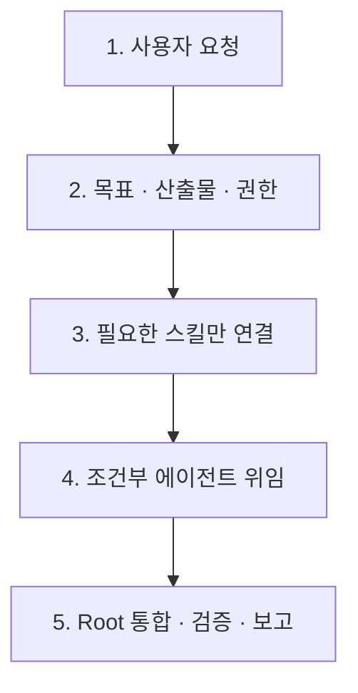

# Codex Agent Kit

현재 실제로 사용하는 개인 Codex 운영 레이어의 source of truth입니다. 짧은 요청의 의도를 정리하고, 가장 정확한 스킬과 필요한 에이전트만 연결해 품질 높은 결과를 내도록 구성했습니다.

공개 페이지: <https://seung-won-yu.github.io/codex-agent-kit/>

## 한눈에 보기

> **간단히 요청해도 → 의도를 정리하고 → 필요한 스킬만 연결하고 → 필요할 때만 에이전트를 쓰고 → 루트가 끝까지 검증합니다.**

| 단계 | 실제 동작 |
| --- | --- |
| 요청 이해 | 목표, 필요한 산출물과 수정 권한의 상한을 내부적으로 정리 |
| 스킬 선택 | 가장 좁은 `primary` 1개와 필요한 `adapter / verifier / safety`만 연결 |
| 에이전트 위임 | 서로 기다리지 않는 큰 작업축이 2개 이상일 때만 최대 3개 사용 |
| 통합과 검증 | 루트가 단일 writing lane, 결과 통합, 최종 검증과 사용자 응답을 소유 |
| 프로젝트 분리 | 범용 36개는 전역, 전문 11개는 연결된 프로젝트에서만 노출 |

## 현재 구성

| 영역 | 설정 |
| --- | --- |
| 기본 모델 | `gpt-5.6-sol` + `high` |
| 최고품질 profile | `codex --profile xhigh` |
| Custom agents | 3 |
| Global personal skills | 36 |
| Project-packed skills | 11 |
| Project packs | `game`, `visual`, `supabase` |
| Domain playbooks | 4 |
| Connected plugins | 10 |
| Routing regression cases | 40 |

## 설치

Codex desktop app과 CLI가 설치되고 로그인된 macOS 환경에서:

```bash
git clone https://github.com/Seung-Won-Yu/codex-agent-kit.git
cd codex-agent-kit
./scripts/install.sh --exact --with-config --plugins
```

이 명령은 다음 personal layer를 설치합니다.

- Global `AGENTS.md`
- quality-first `config.toml`
- `xhigh.config.toml`
- 3 custom agents와 4 playbooks
- 36 global skills
- 11 packed skills와 project manifest
- validator와 routing corpus
- 현재 사용하는 10개 Codex plugin

`--exact`는 기존 personal agents, global skills와 packs를 `$CODEX_HOME/backups/codex-agent-kit-<timestamp>/`로 옮긴 뒤 현재 구성을 설치합니다. Codex가 제공하는 `skills/.system`은 유지합니다.

기존 구성에 병합만 하려면:

```bash
./scripts/install.sh
```

config와 plugin까지 적용하되 기존 개인 스킬을 유지하려면:

```bash
./scripts/install.sh --with-config --plugins
```

설치 후 프로젝트 위치가 다르면 `~/.codex/skill-packs/manifest.yaml`의 `scan_roots`와 `projects`만 맞춘 뒤 Codex를 다시 시작합니다.

```bash
python3 "$HOME/.codex/scripts/validate-skills.py"
codex --profile xhigh
```

Codex의 최신 profile 방식은 기본 `~/.codex/config.toml` 위에 `~/.codex/xhigh.config.toml`을 overlay합니다.

## 요청 처리 흐름



- 정확한 스킬이 필요 없으면 루트가 바로 실행합니다.
- 에이전트는 독립적인 큰 작업축이 2개 이상일 때만 사용합니다.

## Custom agents

| Agent | 모델·권한 | 역할 |
| --- | --- | --- |
| `explorer-fast` | GPT-5.6 Terra medium · read-only | 독립적인 코드 탐색과 현재 자료 리서치 |
| `reviewer-deep` | GPT-5.6 Sol high · read-only | 중요한 변경의 정확성·회귀·보안 독립 리뷰 |
| `verifier` | GPT-5.6 Terra medium · workspace-write | 테스트·lint·type check·build·browser flow 검증 |

하위 에이전트는 최대 3개, 깊이 1이며 루트 에이전트가 항상 쓰기와 통합을 소유합니다.

## Personal skills

36개 global skill은 여러 프로젝트에서 반복되는 범용 작업을 담당합니다.

| 영역 | Skills |
| --- | --- |
| 구현·검증 | `incremental-implementation`, `diagnose`, `frontend-ui-engineering`, `product-frontend-engineer`, `code-review-and-quality`, `playwright`, `webapp-testing` |
| 제품·품질 | `design-flow`, `frontend-design-audit`, `accessibility`, `web-quality-audit` |
| 설계·보안 | `system-design`, `api-and-interface-design`, `database-schema-designer`, `security-and-hardening` |
| 기획·전략 | `create-prd`, `product-strategy`, `planning-document-writer`, `ax-consulting-planner`, `risk-assessment` |
| 리서치·문서 | `research-synthesizer`, `research-report-writer`, `technical-writer`, `documentation-and-adrs`, `runbook-generator`, `release-notes`, `handoff` |
| 개발 운영 | `gh-cli`, `gh-fix-ci`, `dependency-auditor`, `docker-debugger`, `env-setup-wizard`, `vercel-deploy` |
| 미디어·모드·설정 | `media-image-director`, `caveman`, `routing-doctor` |

11개 specialist skill은 필요한 프로젝트의 `.agents/skills/`에서만 보입니다.

| Pack | Skills | 담당 |
| --- | --- | --- |
| `game` | `mobile-game-design`, `mobile-game-qa`, `game-reference-research`, `game-ui-art-direction`, `player-experience-review`, `prototype-slice-planner` | 모바일 게임 기획, UI, 플레이 경험, prototype과 QA |
| `visual` | `claude-design`, `gpt-taste`, `image-to-code` | 고밀도 visual concept, motion-rich web, image-first 구현 |
| `supabase` | `supabase`, `supabase-postgres-best-practices` | Supabase workflow, Postgres query·schema·RLS 최적화 |

각 스킬이 언제 선택되고 무엇을 담당하는지는 [Skill Catalog](docs/skill-catalog.md)에 정리했습니다.

## Connected plugins

| Plugin | 역할 |
| --- | --- |
| Documents | DOCX 생성·편집·redline·렌더 검증 |
| Spreadsheets | XLSX·CSV 분석과 workbook 생성 |
| Presentations | PPTX·Google Slides용 발표 자료 |
| PDF | PDF 읽기·생성·페이지 렌더 검증 |
| Template Creator | 문서를 재사용 가능한 artifact template로 변환 |
| Sites | 웹사이트 source, version, production deployment 관리 |
| Browser | Codex 내 독립 브라우저 자동화 |
| Chrome | 기존 로그인과 탭을 사용하는 Chrome 자동화 |
| Computer Use | macOS 앱과 데스크톱 UI 제어 |
| Visualize | 차트, 비교 도구와 interactive visualization |

Plugin만 설치하려면:

```bash
./scripts/install-plugins.sh
```

## Repository 구조

```text
.
├── AGENTS.md
├── agents/
│   ├── explorer-fast.toml
│   ├── reviewer-deep.toml
│   ├── verifier.toml
│   └── playbooks/
├── config/
│   ├── codex.config.sample.toml
│   └── xhigh.config.sample.toml
├── skills/                    # 36 global personal skills
├── skill-packs/               # 11 project-packed skills
├── scripts/
│   ├── install.sh
│   ├── install-plugins.sh
│   └── validate-skills.py
├── docs/
├── index.html
└── assets/
```

## 검증

```bash
python3 "$HOME/.codex/scripts/validate-skills.py"
python3 "$HOME/.codex/skills/routing-doctor/scripts/audit_routing.py"
```

Validator는 skill metadata, 내부 링크, canonical name 중복, project pack symlink, visible skill graph, legacy routing 잔존과 40개 한국어 routing case를 함께 확인합니다.

## License

Vendored skill 디렉터리에 `LICENSE`, `LICENSE.txt` 또는 `NOTICE.txt`가 있으면 해당 파일의 조건이 적용됩니다.
