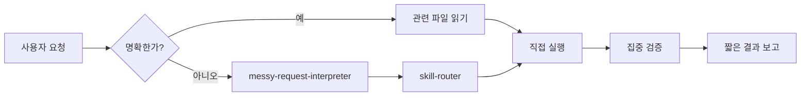

# Codex Agent Kit

Seung-Won Yu가 현재 로컬 workspace에서 실제로 사용하는 Codex 설정을 공유 가능한 형태로 정리한 repository입니다.

이 repo는 `~/.codex` 전체 백업이 아닙니다. 인증값, 세션, 로그, SQLite state, browser session, plugin runtime cache처럼 개인 환경에 묶이거나 민감한 파일은 제외하고, 다른 사람이 읽고 참고할 수 있는 portable layer만 남깁니다.

공개 페이지:

```text
https://seung-won-yu.github.io/codex-agent-kit/
```

## 이 세팅의 목적

Codex는 skills, plugins, MCP, browser automation, 문서/스프레드시트/PDF 도구까지 붙일 수 있어 강력합니다. 하지만 모든 것을 한 번에 켜두면 매 요청마다 어떤 역할과 workflow를 선택해야 하는지 분기가 많아집니다.

이 kit의 목표는 단순합니다.

- 명확한 요청은 바로 실행한다.
- 애매한 요청만 작게 해석하고 라우팅한다.
- 스킬은 대표 workflow 중심으로 lean하게 유지한다.
- 실제 작업은 파일 읽기, 수정, 검증, 짧은 handoff까지 끝낸다.
- 공유 repo에는 규칙과 reusable skills만 남기고 민감한 로컬 상태는 제외한다.

## 핵심 운영 흐름



현재 `AGENTS.md`는 다음 원칙을 기본값으로 둡니다.

- obvious single-domain task는 직접 실행
- 역할 선택이나 router ceremony는 필요할 때만 사용
- fuzzy, shorthand, mixed Korean/English 요청은 `messy-request-interpreter -> skill-router -> execution`
- 스킬은 한 개 primary skill을 우선하고, support skill은 최대 두 개만 추가
- 보안, 인증, 결제, tenant isolation, webhook, untrusted input이 걸리면 security skill 사용
- 사용자가 한국어를 쓰면 한국어로 답변
- routine chat은 caveman-lite 스타일로 짧게, 하지만 문서/README/PRD/API docs 같은 artifact는 정상적인 전문 문체로 작성

## 현재 구성 요약

| 항목 | 값 | 의미 |
| --- | ---: | --- |
| Lean profile skills | 103 | 로컬에서 유지할 대표 skill 목록 |
| Curated repo skills | 31 | 이 repo에 직접 보관하는 custom/curated skills |
| Routing/playbook files | 5 | `routing.md`와 domain playbooks |
| Secrets stored here | 0 | 인증값과 로컬 상태는 저장하지 않음 |

## 왜 이렇게 나눴나

### 1. `AGENTS.md`: 기본 운영 규칙

`AGENTS.md`는 Codex가 매 작업에서 따르는 기본 규칙입니다.

왜 쓰는가:

- 사용자가 매번 "한국어로 답해", "바로 구현해", "불필요한 routing 하지 마"라고 말하지 않아도 됩니다.
- 명확한 요청과 애매한 요청을 다르게 처리하는 기준이 생깁니다.
- 파일 수정, 검증, 결과 보고 방식이 흔들리지 않습니다.

장점:

- 짧은 요청도 일관된 방식으로 처리됩니다.
- 과한 role selection을 줄여 실제 작업으로 더 빨리 들어갑니다.
- 협업 중에도 "이 agent는 어떻게 움직이는가"를 문서로 설명할 수 있습니다.

### 2. `agents/`: 얇은 routing reference

`agents/routing.md`와 `agents/playbooks/`는 애매한 작업에서만 보는 지도입니다.

포함된 playbook:

- `backend.md`: API, schema, auth, data, Supabase/Postgres 기준
- `frontend.md`: UI, responsive, accessibility, browser verification 기준
- `design-prototype.md`: 디자인/프로토타입 요청 해석 기준
- `docs-research.md`: 기술문서, 리서치, 보고서 routing 기준

왜 쓰는가:

- 모든 요청에 큰 workflow를 태우지 않기 위해서입니다.
- 한 요청이 frontend, docs, research처럼 여러 갈래를 걸칠 때 owner를 정하기 위해서입니다.

장점:

- 작은 작업은 가볍게 끝나고, 큰 작업은 놓치는 영역이 줄어듭니다.
- routing 기준이 파일로 남아 수정과 공유가 쉽습니다.

### 3. `config/lean-skills.txt`: lean skill profile

현재 local setup은 `config/lean-skills.txt`를 기준으로 103개의 대표 skill을 유지합니다.

왜 쓰는가:

- 스킬이 많아질수록 선택지가 늘고 routing이 산만해집니다.
- 하지만 design, frontend, backend, Supabase, GitHub, deploy, docs, research, QA는 계속 커버해야 합니다.

장점:

- 실무에 필요한 범위는 유지하면서 noise를 줄입니다.
- skill-router가 과하게 고민할 일이 줄어듭니다.
- 다른 환경으로 옮길 때 "어떤 skill을 남길지" 기준이 명확합니다.

대표 lane:

| Lane | Representative skills |
| --- | --- |
| Intake/routing | `messy-request-interpreter`, `skill-router` |
| Communication | `caveman` |
| Frontend/product | `product-frontend-engineer`, `frontend-ui-engineering`, `frontend-design`, `gpt-taste`, `ux-enhancer` |
| Design artifacts | `claude-design`, `image-to-code`, `media-image-director`, `design-flow` |
| Game work | `mobile-game-design`, `game-ui-art-direction`, `prototype-slice-planner`, `player-experience-review`, `mobile-game-qa` |
| Backend/data | `api-and-interface-design`, `database-schema-designer`, `system-design`, `supabase`, `supabase-postgres-best-practices` |
| Implementation/debugging | `incremental-implementation`, `diagnose`, `test-driven-development`, `code-review-and-quality` |
| Docs/research | `technical-writer`, `planning-document-writer`, `research-report-writer`, `research-synthesizer` |
| GitHub/deploy | `gh-cli`, `gh-address-comments`, `gh-fix-ci`, `vercel-deploy`, `cloudflare-deploy`, `netlify-deploy` |

### 4. `skills/`: curated reusable workflows

이 repo의 `skills/`에는 31개의 custom/curated skill을 보관합니다. 전체 local skill set을 모두 commit하지 않고, 이 kit에서 유지할 가치가 있는 것만 남깁니다.

왜 쓰는가:

- 자주 반복하는 작업 방식을 reusable unit으로 만들기 위해서입니다.
- 특히 frontend polish, game design, Supabase, image generation, Open Design artifact 작업은 prompt만으로 매번 재현하기 어렵습니다.

장점:

- 작업 결과의 품질이 안정됩니다.
- 새 프로젝트에서도 같은 workflow를 빠르게 적용할 수 있습니다.
- skill별 `SKILL.md`, `references/`, `examples/`를 통해 지식이 파일로 남습니다.

### 5. `config/codex.config.sample.toml`: redacted config sample

실제 config에는 local path, project trust, plugin state, MCP path가 들어갈 수 있습니다. 그래서 이 repo에는 구조만 보여주는 sample을 둡니다.

공유되는 형태:

- `model`
- `model_reasoning_effort`
- feature flags
- enabled plugins
- trusted project 예시
- `node_repl` MCP 구조

공유하지 않는 것:

- 실제 인증값
- 실제 private project path
- runtime cache
- browser session
- local-only machine state

주의:

`sandbox_mode = "danger-full-access"`는 신뢰한 workspace에서 빠르게 작업하기 위한 설정입니다. 다른 사람이 이 kit를 사용할 때는 본인 보안 기준에 맞춰 sandbox와 approval policy를 낮추는 것을 권장합니다.

## Repository 구조

```text
.
├── AGENTS.md                         # Global lean agent rules
├── agents/
│   ├── routing.md                    # 얇은 routing reference
│   └── playbooks/                    # backend/frontend/design/docs playbooks
├── config/
│   ├── codex.config.sample.toml      # 민감정보 제거된 config 예시
│   └── lean-skills.txt               # 유지할 대표 skills 목록
├── docs/
│   ├── architecture.md               # 레이어 구조
│   ├── lean-skill-profile.md         # lean profile 설명
│   ├── media-generation-routing.md   # 이미지 생성 routing 기준
│   ├── open-design-imports.md        # Open Design import 설명
│   ├── security-checklist.md         # 공개 전 점검 목록
│   └── skill-catalog.md              # 포함된 skill 설명
├── skills/                           # custom/curated skills
├── scripts/
│   ├── install.sh                    # kit를 ~/.codex로 복사
│   └── prune-skills.sh               # lean profile 기준으로 skills 정리
├── index.html                        # GitHub Pages 공유 사이트
├── assets/                           # site CSS/JS
└── third_party/                      # imported skill license notices
```

## 설치

먼저 파일을 읽고, 본인 환경에 맞는지 확인한 뒤 실행하세요.

```bash
git clone https://github.com/Seung-Won-Yu/codex-agent-kit.git
cd codex-agent-kit
./scripts/install.sh
```

installer가 하는 일:

- 기존 `$CODEX_HOME/AGENTS.md`가 있으면 backup 생성
- repo의 `AGENTS.md`를 `$CODEX_HOME/AGENTS.md`로 복사
- `agents/`를 `$CODEX_HOME/agents/`로 복사
- `skills/`를 `$CODEX_HOME/skills/`로 복사
- `config/lean-skills.txt`를 `$CODEX_HOME/config/lean-skills.txt`로 복사

## Skill 정리

현재 local skill set을 lean profile에 맞추고 싶다면 먼저 dry run을 봅니다.

```bash
./scripts/prune-skills.sh
```

문제가 없을 때만 적용합니다.

```bash
./scripts/prune-skills.sh --apply
```

이 스크립트는 `$CODEX_HOME/config/lean-skills.txt`에 없는 skill을 바로 삭제하지 않고, timestamp가 붙은 backup directory로 이동합니다.

## 수동 설치

자동 스크립트 대신 필요한 파일만 직접 복사할 수도 있습니다.

```bash
mkdir -p "$HOME/.codex/skills" "$HOME/.codex/config"
cp AGENTS.md "$HOME/.codex/AGENTS.md"
cp -R agents "$HOME/.codex/agents"
cp -R skills/* "$HOME/.codex/skills/"
cp config/lean-skills.txt "$HOME/.codex/config/lean-skills.txt"
```

sample config는 그대로 복사하지 말고 내용을 읽고 수정하세요.

```bash
cp config/codex.config.sample.toml "$HOME/.codex/config.toml"
```

## 공개 전 보안 체크

이 repo에는 다음을 commit하지 않습니다.

- `~/.codex/auth.json`
- `.env`, `.env.*`
- API keys, OAuth tokens, refresh tokens, service-role keys
- SQLite state, memory, log, session databases
- browser session files
- plugin runtime cache
- private project paths
- customer/company/private data
- generated screenshots or images with private content

권장 scan:

```bash
rg -n "(api[_-]?key|secret|token|password|Bearer|sk-[A-Za-z0-9]|gho_|github_pat|refresh_token|PRIVATE KEY)" .
```

문서 예시 때문에 일부 match가 나올 수 있습니다. push 전에 직접 확인하세요.

## GitHub Pages

이 repo는 static site를 포함합니다.

```text
index.html
assets/app.css
assets/app.js
```

GitHub Pages를 `main` branch root로 설정하면 공유용 사이트로 바로 사용할 수 있습니다.

## 누구에게 유용한가

- Codex를 개인 작업환경에 맞게 세팅하려는 사람
- skills가 너무 많아져 정리 기준이 필요한 사람
- agent rule, routing, playbook을 어떻게 나눌지 고민하는 사람
- 한국어 기반 Codex workflow를 만들고 싶은 사람
- 본인의 `~/.codex`를 안전하게 공유 가능한 형태로 분리하고 싶은 사람

## 이 repo를 그대로 쓰기 전에

이 kit는 제 workspace 기준으로 맞춘 설정입니다. 그대로 복사할 수는 있지만, 가장 좋은 사용법은 구조를 가져가고 값은 본인 환경에 맞게 조정하는 것입니다.

특히 아래는 반드시 확인하세요.

- sandbox mode
- trusted project path
- enabled plugins
- MCP command path
- skill profile 유지 범위
- 한국어/영어 응답 선호
- security policy

## License And Notices

Imported materials and third-party notices are documented under `third_party/` and related docs. See `NOTICE.md` for details.
