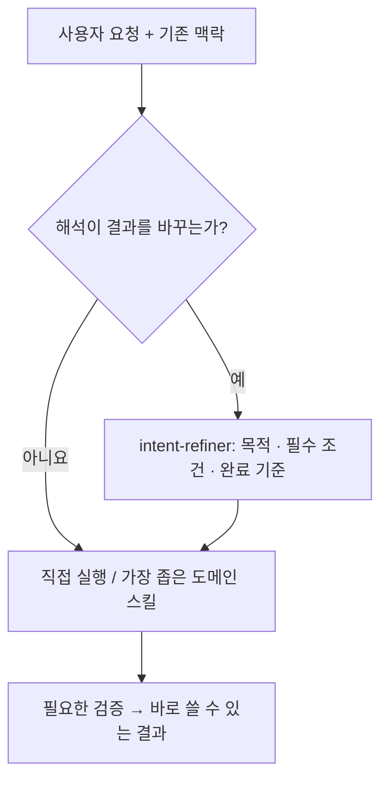

# Codex Agent Kit

GPT-6 Astra에 맞춘 개인 Codex 운영 설정입니다. 명확한 요청은 바로 실행하고, 해석에 따라 결과가 달라질 요청만 `intent-refiner`로 보정합니다. 필요한 작업을 끝까지 완성하면서 반복 설명·탐색·검증을 줄입니다.

공개 페이지: <https://seung-won-yu.github.io/codex-agent-kit/>

## 한눈에 보기

> **명확하면 바로 실행 → 모호하면 한 번 보정 → 필요한 스킬로 작업 → 쓸 수 있는 결과까지 검증합니다.**

| 단계 | 실제 동작 |
| --- | --- |
| 요청 이해 | 기존 맥락과 결정을 재사용하고 명확한 요청은 바로 실행 |
| 조건부 보정 | `intent-refiner`로 목적·필수 조건·완료 기준 정리 후 도메인 작업으로 진행 |
| 스킬 선택 | 가장 좁은 `primary` 1개와 필요한 `adapter / verifier / safety`만 연결 |
| 에이전트 위임 | 서로 기다리지 않는 큰 작업축이 2개 이상일 때만 최대 3개 사용 |
| 통합과 검증 | 루트가 단일 writing lane, 결과 통합, 최종 검증과 사용자 응답을 소유 |
| 프로젝트 분리 | 범용 37개는 전역, 전문 11개는 연결된 프로젝트에서만 노출 |

## 현재 구성

| 영역 | 설정 |
| --- | --- |
| 기본 모델 | `gpt-6-astra` + `high` |
| 선택형 추론 profile | `codex --profile xhigh` |
| Custom agents | 3 |
| Global personal skills | 37 |
| Project-packed skills | 11 |
| Project packs | `game`, `visual`, `supabase` |
| Domain playbooks | 4 |
| Connected plugins | 10 |
| Routing regression cases | 53 |

## 설치

Codex desktop app과 CLI가 설치되고 로그인된 macOS 환경에서:

```bash
git clone https://github.com/Seung-Won-Yu/codex-agent-kit.git
cd codex-agent-kit
./scripts/install.sh --exact --with-config --plugins
```

이 명령은 다음 personal layer를 설치합니다.

- Global `AGENTS.md`
- Astra high · workspace-write `config.toml`
- `xhigh.config.toml`
- 3 custom agents와 4 playbooks
- 37 global skills
- 11 packed skills와 project manifest
- validator와 routing corpus
- 현재 사용하는 10개 Codex plugin

`--exact`는 기존 personal agents, global skills와 packs를 `$CODEX_HOME/backups/codex-agent-kit-<timestamp>/`로 옮긴 뒤 현재 구성을 설치합니다. Codex가 제공하는 `skills/.system`은 유지합니다.

기존 구성에 병합만 하려면:

```bash
./scripts/install.sh
```

config와 plugin까지 적용하되 기존 개인 스킬을 유지하려면:

```bash
./scripts/install.sh --with-config --plugins
```

설치 후 프로젝트 위치가 다르면 `~/.codex/skill-packs/manifest.yaml`의 `scan_roots`와 `projects`만 맞춘 뒤 Codex를 다시 시작합니다.

```bash
python3 "$HOME/.codex/scripts/validate-skills.py"
codex --profile xhigh
```

Codex의 최신 profile 방식은 기본 `~/.codex/config.toml` 위에 `~/.codex/xhigh.config.toml`을 overlay합니다.

## 요청 처리 흐름


```mermaid
flowchart TD
  A["사용자 요청 + 기존 맥락"] --> B{"해석이 결과를 바꾸는가?"}
  B -->|아니요| D["직접 실행 / 가장 좁은 도메인 스킬"]
  B -->|예| C["intent-refiner: 목적 · 필수 조건 · 완료 기준"]
  C --> D
  D --> E["필요한 검증 → 바로 쓸 수 있는 결과"]
```

- 길이가 아니라 해석의 불확실성이 기준입니다. 긴 명세, 작은 수정, 산출물이 명확한 점검·제안은 보정을 건너뜁니다.
- 보정은 같은 모델에서 한 번 수행하며 별도 모델·에이전트·라우터를 호출하지 않습니다. 후속 요청에서는 바뀐 결정만 반영합니다.
- 이전 수정 승인은 같은 대상에서 이어받고, “원인만 / 수정하지 마” 같은 이후 제한은 지킵니다.
- 검증은 변경에 맞춰 수행하고 새로운 문제 없이 통과한 검사를 반복하지 않습니다. 고정 화면 크기·단계별 전체 빌드·자동 커밋을 완료 조건으로 강제하지 않습니다.
- 에이전트는 독립적인 큰 작업축의 병렬 작업이나, 중요한 변경 뒤의 독립 검증에만 사용합니다.

## Custom agents

| Agent | 모델·권한 | 역할 |
| --- | --- | --- |
| `explorer-fast` | GPT-5.6 Terra medium · read-only | 독립적인 코드 탐색과 현재 자료 리서치 |
| `reviewer-deep` | GPT-5.6 Sol high · read-only | 중요한 변경의 정확성·회귀·보안 독립 리뷰 |
| `verifier` | GPT-5.6 Terra medium · workspace-write | 테스트·lint·type check·build·browser flow 검증 |

하위 에이전트는 최대 3개, 깊이 1이며 루트 에이전트가 항상 쓰기와 통합을 소유합니다.

## Personal skills

37개 global skill은 여러 프로젝트에서 반복되는 범용 작업을 담당합니다.

| 영역 | Skills |
| --- | --- |
| 구현·검증 | `incremental-implementation`, `diagnose`, `frontend-ui-engineering`, `product-frontend-engineer`, `code-review-and-quality`, `playwright`, `webapp-testing` |
| 제품·품질 | `design-flow`, `frontend-design-audit`, `accessibility`, `web-quality-audit` |
| 설계·보안 | `system-design`, `api-and-interface-design`, `database-schema-designer`, `security-and-hardening` |
| 기획·전략 | `create-prd`, `product-strategy`, `planning-document-writer`, `ax-consulting-planner`, `risk-assessment` |
| 리서치·문서 | `research-synthesizer`, `research-report-writer`, `technical-writer`, `documentation-and-adrs`, `runbook-generator`, `release-notes`, `handoff` |
| 개발 운영 | `gh-cli`, `gh-fix-ci`, `dependency-auditor`, `docker-debugger`, `env-setup-wizard`, `vercel-deploy` |
| 의도·미디어·모드·설정 | `intent-refiner`, `media-image-director`, `caveman`, `routing-doctor` |

11개 specialist skill은 필요한 프로젝트의 `.agents/skills/`에서만 보입니다.

| Pack | Skills | 담당 |
| --- | --- | --- |
| `game` | `mobile-game-design`, `mobile-game-qa`, `game-reference-research`, `game-ui-art-direction`, `player-experience-review`, `prototype-slice-planner` | 모바일 게임 기획, UI, 플레이 경험, prototype과 QA |
| `visual` | `claude-design`, `gpt-taste`, `image-to-code` | 고밀도 visual concept, motion-rich web, image-first 구현 |
| `supabase` | `supabase`, `supabase-postgres-best-practices` | Supabase workflow, Postgres query·schema·RLS 최적화 |

각 스킬이 언제 선택되고 무엇을 담당하는지는 [Skill Catalog](docs/skill-catalog.md)에 정리했습니다.

## Connected plugins

| Plugin | 역할 |
| --- | --- |
| Documents | DOCX 생성·편집·redline·렌더 검증 |
| Spreadsheets | XLSX·CSV 분석과 workbook 생성 |
| Presentations | PPTX·Google Slides용 발표 자료 |
| PDF | PDF 읽기·생성·페이지 렌더 검증 |
| Template Creator | 문서를 재사용 가능한 artifact template로 변환 |
| Sites | 웹사이트 source, version, production deployment 관리 |
| Browser | Codex 내 독립 브라우저 자동화 |
| Chrome | 기존 로그인과 탭을 사용하는 Chrome 자동화 |
| Unified Computer Use | 연결된 브라우저 UI 제어; 지원 범위는 실행 환경에 따름 |
| Visualize | 차트, 비교 도구와 interactive visualization |

Plugin만 설치하려면:

```bash
./scripts/install-plugins.sh
```

## Repository 구조

```text
.
├── AGENTS.md
├── agents/
│   ├── explorer-fast.toml
│   ├── reviewer-deep.toml
│   ├── verifier.toml
│   └── playbooks/
├── config/
│   ├── codex.config.sample.toml
│   └── xhigh.config.sample.toml
├── skills/                    # 37 global personal skills
├── skill-packs/               # 11 project-packed skills
├── scripts/
│   ├── install.sh
│   ├── install-plugins.sh
│   └── validate-skills.py
├── docs/
├── index.html
└── assets/
```

## 불필요한 중간 작업 줄이기

- 디자인 단계마다 스킬을 연쇄 호출하지 않고, 기존 brief와 담당 스킬로 해결하지 못하는 부분에만 전문 지침을 추가합니다.
- 문서의 완성도와 파일 형식을 별도로 판단합니다. 사용 목적과 기존 형식에 맞춰 Markdown·Office를 선택하며 필요한 파일 생성·렌더 검증은 유지합니다.
- 확인한 자료는 재사용하고, 변경 부분과 필요한 오류 근거를 우선 읽습니다. 사용자 레퍼런스를 따르는 색·카드·효과를 일괄 금지하지 않습니다.
- 이전 승인은 같은 대상·행위·목적에만 이어받습니다. 개인 설정 변경이 관련 저장소 수정이나 게시 승인으로 확대되지 않습니다.

두 스킬(`design-flow`, `planning-document-writer`)의 본문을 포함한 SKILL.md 글자 수 합계는 10,205자에서 6,695자로 약 34% 줄었습니다. 이는 실제 작업 토큰 절감률이 아닙니다. 이번 정리는 정적·설치 검사로 확인했으며 추가 모델 벤치마크를 실행하지 않았습니다. 공개 모델 예시와 각 사용자의 개인 기본값은 별도로 관리합니다.

## 검증

Python 3와 PyYAML이 필요합니다. 계정 연결이나 개인 프로젝트 경로 없이 저장소를 검사하려면:

```bash
python3 scripts/validate-skills.py --root . --static
python3 scripts/test_static_validation.py
python3 scripts/test_efficiency_harness.py
```

설치된 환경과 연결 상태를 확인하려면:

```bash
python3 "$HOME/.codex/scripts/validate-skills.py"
python3 "$HOME/.codex/skills/routing-doctor/scripts/audit_routing.py"
```

앱과 터미널의 Codex 버전이 다르면 두 검사 모두 `--codex /path/to/codex`로 검증할 실행 파일을 지정할 수 있습니다. 프로젝트를 이동하거나 삭제했다면 `skill-packs/manifest.yaml`의 연결도 정리하세요. `projects: []`인 스킬은 보관된 상태이며 필요한 프로젝트에 연결할 수 있습니다.

Validator는 skill metadata, 내부 링크, canonical name 중복, project pack symlink, visible skill graph, legacy routing 잔존과 53개 한국어 routing case를 함께 확인합니다.

보정 구조는 Astra high의 격리된 두 작업에서 확인했습니다. 명확한 오타 수정은 보정을 생략했고, 거친 교육 메모는 보정 후 준비·절차·성공 확인이 있는 안내문으로 완성했습니다. 이는 대표 동작 확인이며 전체 작업 품질이나 토큰 절감률의 벤치마크는 아닙니다.

스킬 절차 완화는 추가로 6개 요청을 수정 전·후 각각 실행해 비교했습니다. 표본의 완료 품질과 권한 준수는 유지됐고 일부 도구 호출은 줄었지만, 입력 토큰은 감소하지 않았습니다. [실행 조건·사례별 결과·측정 한계](docs/evaluations/2026-09-09.md)를 확인하세요.

설계 근거: [공식 Astra 행동 가이드](https://developers.openai.com/api/docs/guides/latest-model#gpt-6-astra-behavior).

## License

Vendored skill 디렉터리에 `LICENSE`, `LICENSE.txt` 또는 `NOTICE.txt`가 있으면 해당 파일의 조건이 적용됩니다.
