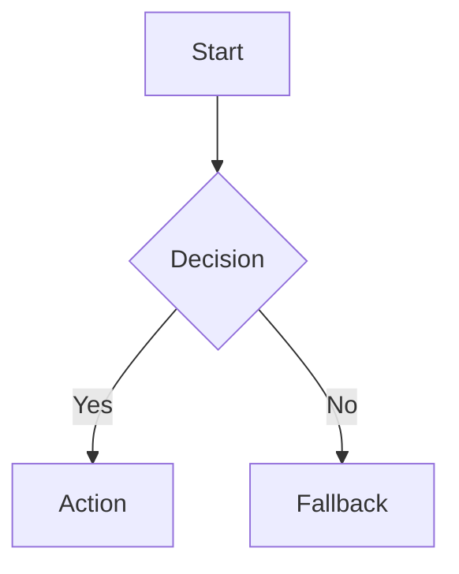

# Planning Document Types

Use this table to choose a document format before drafting.

| User asks for | Best artifact | Use when | Pair with |
|---|---|---|---|
| 게임 기획서, GDD | Game Design Document | Game concept, mechanics, progression, systems, content | `mobile-game-design`, `game-ui-art-direction` |
| 코어루프, 재미 구조 | Core Loop Brief | Need gameplay loop clarity before full GDD | `mobile-game-design` |
| 첫 프로토타입, MVP | Prototype Slice Brief | Need smallest buildable game/app slice | `prototype-slice-planner`, `incremental-implementation` |
| 서비스 기획서 | Product One-Pager or PRD | Stakeholder alignment or product direction | `create-prd`, `product-strategy` |
| 요구사항정의서 | Requirements Definition | Business/user/system requirements need to be listed and scoped | `planning-document-writer`, `system-design` |
| 기능명세서 | Feature Specification | Developer handoff needs behavior, edge cases, data, API, UX flow | `planning-document-writer`, `incremental-implementation` |
| 화면설계서, IA | Screen Flow / IA Spec | Designer/frontend handoff needs screens, states, navigation | `product-frontend-engineer`, `frontend-ui-engineering` |
| 플로우차트, user flow | Flowchart / User Flow | Need process, user journey, state transition, or decision path | `product-frontend-engineer`, `system-design` |
| API 명세 | API Specification | Endpoints, request/response, errors, auth, versioning | `api-and-interface-design`, `technical-writer` |
| DB 설계서 | Data Model / Schema Spec | Entities, relationships, indexes, migrations | `database-schema-designer` |
| 시스템 설계서 | System Design Doc | Services, boundaries, data flow, scaling, reliability | `system-design` |
| 개발계획서 | Implementation Plan | Work needs tasks, sequencing, risk, verification | `incremental-implementation`, `risk-assessment` |
| QA 시나리오 | Test Scenarios / UAT Plan | QA or acceptance validation is the main output | `webapp-testing`, `mobile-game-qa` when game-related |
| 운영문서 | Runbook | Operators need response steps and checks | `runbook-generator` |
| SOP | Standard Operating Procedure | Repeatable business or ops process | `runbook-generator`, `technical-writer` |
| 기술 의사결정 | ADR | Need to record why an architecture choice was made | `documentation-and-adrs` |
| 릴리즈 문서 | Release Notes / Launch Checklist | Communicate changes or prepare launch | `release-notes`, `risk-assessment` |
| 리서칭보고서, 조사보고서 | Research Report | Need source-backed findings and recommendation | `research-report-writer`, `research-synthesizer` |

## Default Templates

Use these as submission-ready default archetypes when no company template is provided. They are not placeholders; fill them with concrete content and omit sections that do not apply.

### Submission-Ready Document Style

- Cover/header: title, subtitle, version/date, author or team, status.
- Executive summary: purpose, recommendation, key decisions, expected outcome.
- Main body: structured sections matched to the artifact type.
- Evidence/requirements: tables, flows, assumptions, constraints, references.
- Handoff: acceptance criteria, owners, next steps, open decisions.
- Appendix: detailed tables, glossary, source list, or change history when useful.

Default visual treatment for `.docx`: formal business brief, clear heading hierarchy, metadata block, restrained accent color, readable tables, and enough spacing for review/approval use.

Default visual treatment for `.pptx`: title slide, agenda/context, problem/opportunity, recommendation, proof/detail slides, decision or next-step slide.

Default visual treatment for `.xlsx`: summary/dashboard or instructions sheet first, then structured input/data sheets, validation/check columns, and frozen/filterable tables.

### Requirements Definition

1. Background / objective
2. Scope / non-scope
3. User roles
4. Functional requirements
5. Non-functional requirements
6. Data requirements
7. External integrations
8. Flowchart or user flow
9. Acceptance criteria
10. Open questions

Submission-ready additions:

- Document control: version, owner, reviewers, approval status.
- Requirement table: ID, category, priority, description, rationale, acceptance criteria.
- Traceability table when implementation/QA handoff matters.

### Feature Specification

1. Summary
2. User problem
3. Goals / non-goals
4. Primary scenarios
5. Detailed behavior
6. UX flow and screen states
7. Data model
8. API contract
9. Edge cases and errors
10. Acceptance criteria and test notes

Submission-ready additions:

- Feature metadata: owner, target release, dependencies, status.
- Scenario table: scenario, trigger, user action, system behavior, edge cases.
- Handoff checklist: frontend, backend, data, QA, analytics, rollout.

### GDD

1. Game overview
2. Target player
3. Player fantasy
4. Core loop
5. Controls and moment-to-moment play
6. FTUE / first session
7. Progression and economy
8. Content structure
9. UI/HUD requirements
10. Monetization/live-ops, if relevant
11. Analytics and success metrics
12. Prototype scope and risks

### Screen Flow / IA

1. User goal
2. Screen list
3. Navigation map
4. State table
5. Empty/loading/error states
6. Permission and auth gates
7. Content rules
8. Mermaid user flow
9. Handoff notes for frontend/design

### Flowchart

Use Mermaid by default:

### API Specification

1. Resource overview
2. Auth and permission
3. Endpoint table
4. Request schema
5. Response schema
6. Error codes
7. Rate limits/idempotency
8. Versioning and compatibility
9. Examples

Submission-ready additions:

- Endpoint matrix: method, path, purpose, auth, request, response, errors.
- Schema tables for request/response fields with type, required, validation, notes.
- Compatibility section for versioning, deprecation, idempotency, and rate limits.

### DB Design Specification

1. Context and data ownership
2. Entity overview
3. ERD or relationship summary
4. Table definitions
5. Index and constraint strategy
6. Migration plan
7. Access control / RLS / tenancy
8. Query and reporting considerations
9. Backup, retention, audit, and privacy notes
10. Open risks and review checklist

Submission-ready additions:

- Table dictionary: table, purpose, key columns, relationships, indexes, lifecycle.
- Migration checklist: additive changes, backfill, compatibility, rollback.

### QA Scenario

1. Test objective
2. Preconditions
3. Test data
4. Steps
5. Expected result
6. Negative/edge cases
7. Acceptance status

Submission-ready additions:

- Test matrix: ID, area, priority, precondition, steps, expected result, status.
- Coverage summary: happy path, negative path, permission path, edge cases, regression.
